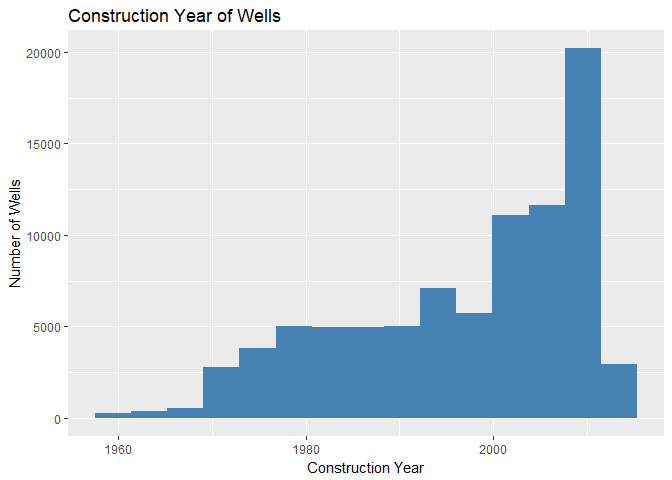
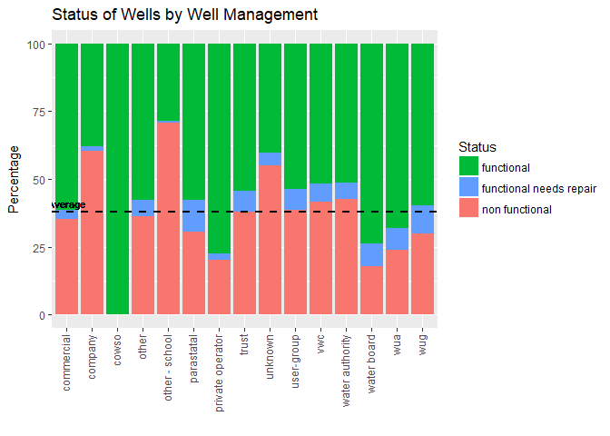

Taarifa Report
================
Hubert Luo and Amanda Wu
August 10, 2018

Introduction
------------

This report analyzes the status of wells in Tanzania, with 59,400 wells in the Taarifa dataset from the DrivenData competition and 72,909 wells from the Taarifa API, resulting in a total of 132,309 wells. We also took a brief look at alternative data collected on the distance of each well to the nearest road. Each of the wells had a status (functional, non-functional, or functional but in need of repair) as well as various attributes, such as the extraction type or source of the well. A data dictionary describing each of the attributes is listed below. Note that not all of these attributes are present in both datasets.

Data Dictionary
---------------

-   amount\_tsh - Total static head (amount water available to waterpoint)
-   date\_recorded - The date the row was entered
-   funder - Who funded the well
-   gps\_height - Altitude of the well
-   installer - Organization that installed the well
-   longitude - GPS coordinate
-   latitude - GPS coordinate
-   wpt\_name - Name of the waterpoint if there is one
-   basin - Geographic water basin
-   subvillage - Geographic location
-   region - Geographic location
-   region\_code - Geographic location (coded)
-   district\_code - Geographic location (coded)
-   lga - Geographic location
-   ward - Geographic location
-   population - Population around the well
-   public\_meeting - True/False
-   recorded\_by - Group entering this row of data
-   scheme\_management - Who operates the waterpoint
-   scheme\_name - Who operates the waterpoint
-   permit - If the waterpoint is permitted
-   construction\_year - Year the waterpoint was constructed
-   extraction\_type - The kind of extraction the waterpoint uses
-   extraction\_type\_group - The kind of extraction the waterpoint uses
-   extraction\_type\_class - The kind of extraction the waterpoint uses
-   management - How the waterpoint is managed
-   management\_group - How the waterpoint is managed
-   payment - What the water costs
-   payment\_type - What the water costs
-   water\_quality - The quality of the water
-   quality\_group - The quality of the water
-   quantity - The quantity of water
-   quantity\_group - The quantity of water
-   source - The source of the water
-   source\_type - The source of the water
-   source\_class - The source of the water
-   waterpoint\_type - The kind of waterpoint
-   waterpoint\_type\_group - The kind of waterpoint
-   NEAR\_DIST - Distance to nearest road

Data Summary
------------

### Categorical Variables

We first summarize some of the categorical variables, specifically water quantity, extraction type, waterpoint type, payment type, source, water quality, management type, and well status in the tables below. Note the last attribute in each row, specified (other), includes wells of known attribute that do not fall into one of the attributes listed above.

|     |      quantity      |  extraction\_type |          waterpoint\_type         |      payment     |
|-----|:------------------:|:-----------------:|:---------------------------------:|:----------------:|
|     |     dry :13307     |   gravity :59729  |           unknown :72909          |  annually : 8136 |
|     |    enough :74259   | nira/tanira:18244 |     communal standpipe :28522     |  monthly :18636  |
|     | insufficient:33841 |    other :14407   |          hand pump :17488         | never pay :55750 |
|     |   seasonal : 9130  | submersible:12575 |            other : 6380           | on failure: 8743 |
|     |   unknown : 1772   |   swn 80 : 8250   | communal standpipe multiple: 6103 |   other : 2393   |
|     |         NA         |    mono : 5759    |       improved spring : 784       | per bucket:19615 |
|     |         NA         |   (Other) :13345  |           (Other) : 123           |  unknown :19036  |

|     |         source\_type        | quality\_group | management\_group |         status\_group         |
|-----|:---------------------------:|:--------------:|:-----------------:|:-----------------------------:|
|     |        spring :37778        | colored : 1092 | user-group :52490 |       functional :72531       |
|     |     shallow well :37735     |  fluoride: 484 |     vwc :49112    | functional needs repair: 9469 |
|     |       borehole :26119       |  good :113224  |     wug : 8103    |     non functional :50309     |
|     |      river/lake :13056      |  milky : 1801  | parastatal : 4006 |               NA              |
|     | river/lake/river/lake:10377 |  salty : 11500 | water board: 3776 |               NA              |
|     | rainwater harvesting : 5128 | unknown : 4208 | commercial : 3638 |               NA              |
|     |        (Other) : 2116       |       NA       |   (Other) :11184  |               NA              |

We then analyzed the continuous data in the tables and graphs below, focusing on population and construction year. From the summary below, we see that the data is heavily right skewed, with a long right tail as the majority of wells have surrounding populations of less than 1,000 while some have populations that far exceed 1,000 and reach as high as 30,500. The standard deviation is also extremely large at 562.83 even though 75% of the data is less than or equal to 325, demonstrating the large effect the extremely high population values have on our data.

    ##    Min. 1st Qu.  Median    Mean 3rd Qu.    Max. 
    ##     1.0    40.0   150.0   282.5   325.0 30500.0

### Summary of Well Status

We then took a closer look at well status. As mentioned in the introduction, each of the wells has 3 possible statuses, as summarized below. 38.02% of wells are non-functional, while 7.16% are functional and in need of repair and the rest (54.82%) are functional without being in need of repair

| Well Status             |  Percentage of Wells|
|:------------------------|--------------------:|
| functional              |                54.82|
| functional needs repair |                 7.16|
| non functional          |                38.02|

### Continuous Variables

As a result, when binning our data for future analysis we decided to organize the population observations in to 10 bins of size 100, ranging from 0 to 1,000 and putting all the populations exceeding 1,000 into the final bin of 900 to 1,000 in order to reduce the disproportionately large affect these extreme values played in our analysis. The final summary counts and a histogram are displayed below.

|              |  Number of Wells|
|--------------|----------------:|
| (0,100\]     |            35638|
| (100,200\]   |            15278|
| (200,300\]   |            11990|
| (300,400\]   |             6876|
| (400,500\]   |             4942|
| (500,600\]   |             2710|
| (600,700\]   |             1512|
| (700,800\]   |             1383|
| (800,900\]   |              666|
| (900,1e+03\] |             4123|

We then analyzed the construction year of wells, with a summary and histogram displayed below. The wells ranged from being constructed in 1960 to 2014, with a median of 2000.

    ##    Min. 1st Qu.  Median    Mean 3rd Qu.    Max. 
    ##    1960    1988    2000    1997    2008    2014

Finally, we looked at the distance to the nearest road. The data is extremeley right-skewed, as the mean of 106,936 exceeds even that of the 75th percentile of 7,879. As a result, we capped the distances at 50,000 and assigned all distances greater than 50,000 a value of 50,000. Note that the distances were calculated for the competition dataset so the median was assigned to the remaining values.

    ##    Min. 1st Qu.  Median    Mean 3rd Qu.    Max. 
    ##       0     471    2553  106936    7879 3337890

|                     |  Number of Wells|
|---------------------|----------------:|
| (0,2.5e+03\]        |            29468|
| (2.5e+03,5e+03\]    |             8569|
| (5e+03,7.5e+03\]    |             5765|
| (7.5e+03,1e+04\]    |             3895|
| (1e+04,1.25e+04\]   |             2722|
| (1.25e+04,1.5e+04\] |             1920|
| (1.5e+04,1.75e+04\] |             1384|
| (1.75e+04,2e+04\]   |              900|
| (2e+04,2.25e+04\]   |              757|
| (2.25e+04,2.5e+04\] |              422|
| (2.5e+04,2.75e+04\] |              388|
| (2.75e+04,3e+04\]   |              305|
| (3e+04,3.25e+04\]   |              163|
| (3.25e+04,3.5e+04\] |              149|
| (3.5e+04,3.75e+04\] |              164|
| (3.75e+04,4e+04\]   |              123|
| (4e+04,4.25e+04\]   |              108|
| (4.25e+04,4.5e+04\] |              132|
| (4.5e+04,4.75e+04\] |               56|
| (4.75e+04,5e+04\]   |             2010|

Missing Data
------------

Most of our unkown categorical data is missing at random so keeping these values in our dataset should not create bias. However, water quality, water quantity and extraction types all have large number of missing values as well as higher than average unfunctioning well percentages of 84.03% 71.39%, and 80.6%. Thus, there is evidence that missing values associated with these 3 categories need to be investigated futhur or handled through classification later.

A table summary of the percentage of missing data for each variable is listed below. Note that waterpoint type for all of the data from the Taarifa API was missing so it had the highest percentage of missing values at 55.1%. Population and construction year had missing values around 35% of the time, while the rest of the variables were below 15%. Source, management, and water quantity had the lowest percentages of missing values, with all below 1.5%. In addition, only 65.3% of the wells in the combined dataset had a reported construction year and only 64.3% had a population, with the rest being reported as '0' in the data.

For missing continuous data such as population or year, we replaced the missing values with the median, as the large number of outliers for population especially meant that the median was more meaningful for our data.

|                    |  Percentage|
|--------------------|-----------:|
| quantity           |        1.34|
| extraction\_type   |       10.89|
| waterpoint\_type   |       55.11|
| construction\_year |       34.67|
| payment            |       14.39|
| source             |        0.00|
| population         |       35.67|
| quality            |        3.18|
| management         |        0.95|

Comparing Datasets
------------------

38.42% of the wells in the Taarifa contest dataset were non-functional, compared to 37.7% in the Taarifa API dataset. We then compared some of the variables between the two datasets below.

| Quantity     |  Contest|    API|  Difference (Contest-API)|
|:-------------|--------:|------:|-------------------------:|
| dry          |    10.52|   9.68|                      0.84|
| unknown      |     1.33|   1.35|                     -0.02|
| seasonal     |     6.82|   6.97|                     -0.15|
| insufficient |    25.47|  25.66|                     -0.19|
| enough       |    55.87|  56.33|                     -0.46|

| Payment    |  Contest|    API|  Difference (Contest-API)|
|:-----------|--------:|------:|-------------------------:|
| never pay  |    42.67|  41.70|                      0.97|
| per bucket |    15.13|  14.58|                      0.55|
| annually   |     6.13|   6.16|                     -0.03|
| on failure |     6.59|   6.62|                     -0.03|
| other      |     1.77|   1.84|                     -0.07|
| monthly    |    13.97|  14.18|                     -0.21|
| unknown    |    13.73|  14.92|                     -1.19|

| Source               |  Contest|    API|  Difference (Contest-API)|
|:---------------------|--------:|------:|-------------------------:|
| borehole             |    20.12|  19.44|                      0.68|
| spring               |    28.65|  28.47|                      0.18|
| other                |     0.47|   0.48|                     -0.01|
| rainwater harvesting |     3.86|   3.89|                     -0.03|
| dam                  |     1.10|   1.14|                     -0.04|
| shallow well         |    28.32|  28.68|                     -0.36|
| river/lake           |    17.47|  17.91|                     -0.44|

| Water Quality |  Contest|    API|  Difference (Contest-API)|
|:--------------|--------:|------:|-------------------------:|
| salty         |     8.75|   8.65|                      0.10|
| fluoride      |     0.37|   0.37|                      0.00|
| colored       |     0.82|   0.83|                     -0.01|
| milky         |     1.35|   1.37|                     -0.02|
| good          |    85.55|  85.59|                     -0.04|
| unknown       |     3.16|   3.20|                     -0.04|
|               |       NA|   0.00|                        NA|

Feature Selection
-----------------

We first narrowed down the list of features to only include those that appeared in both datasets and were also meaningful for future analysis on different datasets. For example, we dropped region and latitude/longitude as any conclusions provided by these factors from Tanzania were not broadly applicable to different situations. An exception was made for waterpoint type - we decided to investiagate it as a feature even though it wasn't in both datasets as previous analysis by Topor et. al had identified it as an important predictive feature.

To analyze the importance of features, we used random forest methods to evaluate the importance of each feature by its mean decrease in Gini coefficient. The results are outlined in the table and graph below.

| Feature            |  Mean Decrease in Gini|
|:-------------------|----------------------:|
| quantity           |               7506.126|
| construction\_year |               5498.403|
| extraction\_type   |               4986.375|
| population         |               4827.229|
| payment            |               3117.150|
| source\_type       |               2384.528|
| management\_group  |               2177.702|
| waterpoint\_type   |               1632.550|
| quality\_group     |               1042.618|

As seen above, the most important feature was quantity, followed by construction year, extraction type, and population. The remaining variables demonstrated less importance and in order of decrease importance were payment type, source type, well management, waterpoint type, and water quality.

We then examined each of these features in further depth below. The black dotted line on the graphs marks the overall average percentage of non-functional wells (38.02%). Red bars that extend above this dotted line demonstrate a higher than average propensity to be non-functional, and red bars which are below the dotted line are less likely to be non-functional.

Predictive Features
-------------------

### 1. Water Quantity

| Water Quantity |  Number of Non-Functional Wells|  Percentage of Non-Functional Wells|
|:---------------|-------------------------------:|-----------------------------------:|
| dry            |                           12877|                               96.77|
| unknown        |                            1265|                               71.39|
| insufficient   |                           12905|                               38.13|
| seasonal       |                            2959|                               32.41|
| enough         |                           20303|                               27.34|

It is noteworthy that 96.77% of dry wells are non-functional, while just 27.3% of wells with enough water quantity being non-functional. Clearly, wells with dry or insufficient water quantity are much more likely to be non-functional than those with seasonal or enough water quantity and thus water quantity is one of the most significant features when trying to predict whether a well is functional or not.

### 2. Construction Year

Wells that are constructed later are generally likelier to be functional as well age is proportional to the likelihood of non-functionality. However, only looking at the construction year does not take into account when the well has been last serviced, which would also be important in determining whether a well is functional.

### 3. Extraction Type

| Extraction Type           |  Number of Non-Functional Wells|  Percentage of Non-Functional Wells|
|:--------------------------|-------------------------------:|-----------------------------------:|
| other - mkulima/shinyanga |                               2|                              100.00|
| other                     |                           11612|                               80.60|
| climax                    |                              24|                               75.00|
| other - play pump         |                              55|                               64.71|
| wind-powered              |                              77|                               56.20|
| mono                      |                            3172|                               55.08|
| india mark iii            |                             122|                               52.14|
| windmill                  |                              60|                               51.28|
| unknown                   |                               3|                               50.00|
| ksb                       |                             686|                               48.48|
| other handpump            |                             213|                               47.76|
| other - swn 81            |                             102|                               44.54|
| submersible               |                            5190|                               41.27|
| cemo                      |                              36|                               40.00|
| swn 80                    |                            3071|                               37.22|
| india mark ii             |                            1959|                               36.15|
| rope pump                 |                             182|                               31.60|
| other motorpump           |                              26|                               31.33|
| other - rope pump         |                             141|                               31.26|
| afridev                   |                            1199|                               30.16|
| gravity                   |                           17735|                               29.69|
| walimi                    |                              13|                               27.08|
| nira/tanira               |                            4629|                               25.37|

Gravity pumps are the most reliable extraction method for waterpumps, with a non-functional rate of just 29.7%. The afridev handpump also has a below-average non-functional rate at 30.2%, while other handpumps such as the India mark ii and Swn 80 are just under the average non-functional rate at 36.2% and 27.2% respectively. These findings are likely due to the fact that umps with more complicated extraction types such as mono (motor pump), climax (motor pump), ksb (submersible) and wind-powered, all of which have non-functional rates around 50% or higher, are more prone to failure as they may be less resilient to poor weather and maintenance conditions. It is noteworthy that wells with an 'other' extraction type have an extremely high 80.6% non-functional rate. Possible explanations for this are that less well-known extraction types are more likely to fail because they are not used as widely or that it is more difficult to determine the exact extraction type of a non-functional well and therefore it is more likely to be listed as other.

### 4. Population

Note this only includes 64.33% of the dataset because the rest are missing this factor. In general, wells with a very low surrounding population of between 0 and 10 (note this does *not* include the missing population values of 0) have an extremely high failure rate over 50% while the rest of the wells demonstrate somewhat similar failure rates between 30 and 40%. Somewhat surprisingly, there is no clear evidence of a link between higher population and increasing well non-functionality. This may be due to the fact that their heavy usage is compensated for by better maintenance and resources in larger population areas. In addition, it may be that people naturally settle in large population areas close to natural bodies of water such as a river or spring, which was shown in the section above to have a lower non-functional rate than wells with other sources.

### 5. Payment

| Payment    |  Number of Non-Functional Wells|  Percentage of Non-Functional Wells|
|:-----------|-------------------------------:|-----------------------------------:|
| unknown    |                            9503|                               49.92|
| never pay  |                           26450|                               47.44|
| on failure |                            2700|                               30.88|
| other      |                             737|                               30.80|
| per bucket |                            5215|                               26.59|
| monthly    |                            4260|                               22.86|
| annually   |                            1444|                               17.75|

Wells with a known payment method are more likely to be functional - wells with a payment type of 'never pay' have a 47.4% non-functional rate, much higher than the overall average of 38%. Those with annual payments have the lowest non-functional rate at 17.8%, followed by those with monthly payments at 22.9% and then per bucket payments at 26.6%.

### 6. Source

| Source                |  Number of Non-Functional Wells|  Percentage of Non-Functional Wells|
|:----------------------|-------------------------------:|-----------------------------------:|
| dam                   |                             855|                               57.46|
| borehole              |                           11872|                               45.45|
| shallow well          |                           16804|                               44.53|
| other                 |                             264|                               42.04|
| river/lake/river/lake |                            3517|                               33.89|
| river/lake            |                            4412|                               33.79|
| spring                |                           11274|                               29.84|
| rainwater harvesting  |                            1311|                               25.57|

Wells with a dam source have the highest non-functional rate at 57.5%, followed by machine dbh with 46.6% and borehole wells at 44.8%. Wells that have a rainwater, spring, or river/lake source are much less likely to experience failure with non-functional rates of 25.6%, 29.8% and 33.8% respectively.

### 7. Well Management

| Well Management  |  Number of Non-Functional Wells|  Percentage of Non-Functional Wells|
|:-----------------|-------------------------------:|-----------------------------------:|
| other - school   |                              89|                               70.63|
| company          |                             542|                               60.29|
| unknown          |                             690|                               55.07|
| water authority  |                             493|                               42.46|
| vwc              |                           20516|                               41.77|
| user-group       |                           20332|                               38.73|
| trust            |                              40|                               38.10|
| other            |                             742|                               36.12|
| commercial       |                            1286|                               35.35|
| parastatal       |                            1221|                               30.48|
| wug              |                            2435|                               30.05|
| wua              |                             763|                               23.89|
| private operator |                             481|                               20.24|
| water board      |                             679|                               17.98|

Wells managed by schools saw the highest non-functional rate of 71%, although such management types were rare. Most of the wells were managed by user-groups or vwc's, which had similar non-functioal rates around the average for the entire dataset. Private operators and water boards had the lowest non-functional rates at 20.2% and 18%, although again the number of wells with such management types is much smaller than those managed by user-groups or vwc's.

### 8. Waterpoint Type

| Waterpoint Type             |  Number of Non-Functional Wells|  Percentage of Non-Functional Wells|
|:----------------------------|-------------------------------:|-----------------------------------:|
| other                       |                            5247|                               82.24|
| communal standpipe multiple |                            3220|                               52.76|
| unknown                     |                           27485|                               37.70|
| hand pump                   |                            5654|                               32.33|
| communal standpipe          |                            8536|                               29.93|
| cattle trough               |                              30|                               25.86|
| improved spring             |                             136|                               17.35|
| dam                         |                               1|                               14.29|

The findings in this section come with the caveat that over half of the dataset did not report the waterpoint type, so most of the data falls into the unknown category. Just 29.9% of communal standpipes are non-functional, which is significantly less than the overall average of 38%. Likewise, hand pumps are below average at 32.3%. Multiple communal standpipes have a high failure rate of 52.8% while wells marked 'other' have an extremely high 82.2% non-functional rate. However, this may be due to the fact that it is more difficult to determine the type of a non-functional well and therefore non-functional wells are more likely to be listed as other, which inflates the non-functional rate.

### 9. Water Quality

| Water Quality |  Number of Non-Functional Wells|  Percentage of Non-Functional Wells|
|:--------------|-------------------------------:|-----------------------------------:|
| unknown       |                            3536|                               84.03|
| salty         |                            5444|                               47.34|
| milky         |                             784|                               43.53|
| colored       |                             426|                               39.01|
| good          |                           40009|                               35.34|
| fluoride      |                             110|                               22.73|

The vast majority of wells reported good water quality, and their non-functional rate was slightly lower than the overall average at 35.34%. The wells with the lowest non-functional rates had fluoride water quality and just 22.7% of such wells were non-functional. All other water qualities observed were correlated with higher non-functional rates, with those of unknown water quality topping the list at 84% - this is likely because wells which are non-functional are much more likely to not have any water and thus making it more difficult to determine water quality for water that is not present or only present in limited amounts. Out of wells with a known water quality, salty wells had the highest non-functional rate at 47/3%, followed by milky and coloured water at 43.5% and 39% respectively.

### 10. Distance to Nearest Road

Wells close to roads saw a slightly lower than average nonfunctional rate but there was no significant difference for wells observed that were somewhat close to a road. However, for wells located farther away, especially noticable for those located about 50,000 or more from the nearest road, the non-functional rate increased a noticable amount.

Model Results
-------------

We first split the 132,309 observations randomly into training and testing sets using a 75-25 split, with 75% of the wells in the data going into the training set (99,231 wells) and 25% into the testing set (33,078 wells). We then trained a random forest model on only the training set, before applying our model to the testing set. A confusion matrix comparing the predicted counts and the actual counts is displayed below.

|                            |  Predicted Functional|  Predicted Functional/Repair|  Predicted Non-Functional|
|----------------------------|---------------------:|----------------------------:|-------------------------:|
| Actually Functional        |                 16769|                         1707|                      3611|
| Actually Functional/Repair |                   157|                          293|                        98|
| Actually Non-Functional    |                  1268|                          332|                      8843|

The wells on the diagonal were correctly classified by our model while off-diagonal entries were incorrectly classified. The model was most accurate at predicting the status of a non-functional well with 84.7% of actual non-functional wells predicted as non-functional. However, the model was much worse at predicting the status of functional wells and wells functioning but in need of repair, predicting the correct status 75.9% and 53.5% of the timerespectively. Overall summary statistics of the model are found below.

| Statistic |      Value|
|:----------|----------:|
| Accuracy  |  0.7831489|
| Kappa     |  0.5762644|

The accuracy of our model was 78.3%, lower than the 81.1% accuracy found by Topor et. al in their analysis when using a subset of our data. This is likely because we only focused on features that are applicable for other datasets, thus not including features such as province, latitude, and longitde, which would have made our model more accurate.

References
----------

[Topor et. al](https://rstudio-pubs-static.s3.amazonaws.com/339668_006f4906390e41cea23b3b786cc0230a.html) *Predicting Tanzanian Water Pump Maintenance Needs*
